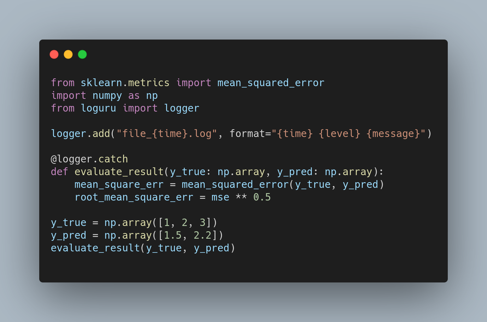
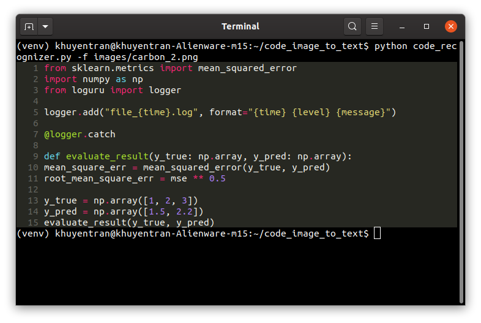

# Code Image to Text Converter

Convert code in image to text and save it to a file.

For example, if you want to extract code from this image.


Typing
```bash
python code_recognizer.py -f name_of_your_image_file -e .py
```
will generate this output

and save the code to `name_of_your_image_file.py` in your current directory.

Note that there is no tab in the output code so you will need to add indentation to make it look like the original code.


